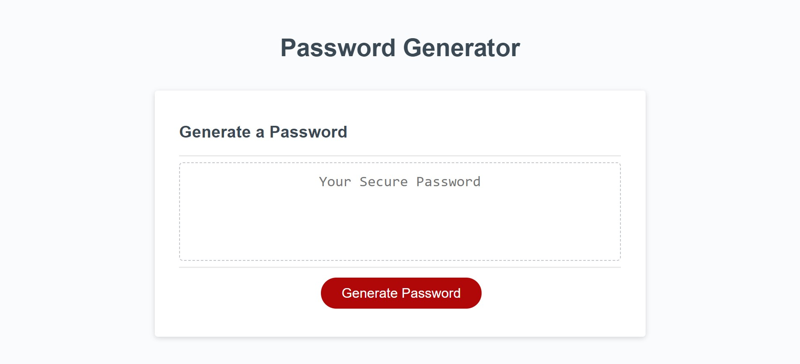

# Password-Generator

Creating an application that can be used to generate a random password using JavaScript

## Discription

The task is to create an app that runs in the browser and features dynamically updated HTML and CSS, all powered by JavaScript code. The app will have a clean and polished user interface that is responsive, ensuring that it adapts to multiple screen sizes. The password can include a combination of lowercase, uppercase, numeric, and special characters.

The application must:

- Generate a password when the button is clicked.

- Present a series of prompts for password criteria:

    - Length of password: At least 10 characters but no more than 64.
    - Character types:
        - Lowercase
        - Uppercase
        - Numeric
        - Special characters ($@%&*, etc.)

- Code should validate for each input and at least one character type should be selected.

## Installation
The link to the application page:
https://dr-jingyuezhao.github.io/Password-Generator/

## Usage 

When opening the code in the browser, the user will be presented with a series of prompts for password criteria. Once all prompts are answered, the password should be generated and displayed within the password box on the page.

**Website demo**

The following image shows the web application's appearance and functionality:

## Credits

Resources:
* https://owasp.org/www-community/password-special-characters
* https://www.w3schools.com/jsref/jsref_concat_array.asp
* https://www.w3schools.com/jsref/jsref_obj_math.asp
* https://www.w3schools.com/js/js_loop_while.asp
* https://www.w3schools.com/js/js_loop_for.asp
* https://www.w3schools.com/js/js_if_else.asp
* https://www.w3schools.com/jsref/met_document_queryselector.asp

## License

MIT License

Copyright (c) 2023 Jasmine

Permission is hereby granted, free of charge, to any person obtaining a copy
of this software and associated documentation files (the "Software"), to deal
in the Software without restriction, including without limitation the rights
to use, copy, modify, merge, publish, distribute, sublicense, and/or sell
copies of the Software, and to permit persons to whom the Software is
furnished to do so, subject to the following conditions:

The above copyright notice and this permission notice shall be included in all
copies or substantial portions of the Software.

THE SOFTWARE IS PROVIDED "AS IS", WITHOUT WARRANTY OF ANY KIND, EXPRESS OR
IMPLIED, INCLUDING BUT NOT LIMITED TO THE WARRANTIES OF MERCHANTABILITY,
FITNESS FOR A PARTICULAR PURPOSE AND NONINFRINGEMENT. IN NO EVENT SHALL THE
AUTHORS OR COPYRIGHT HOLDERS BE LIABLE FOR ANY CLAIM, DAMAGES OR OTHER
LIABILITY, WHETHER IN AN ACTION OF CONTRACT, TORT OR OTHERWISE, ARISING FROM,
OUT OF OR IN CONNECTION WITH THE SOFTWARE OR THE USE OR OTHER DEALINGS IN THE
SOFTWARE.